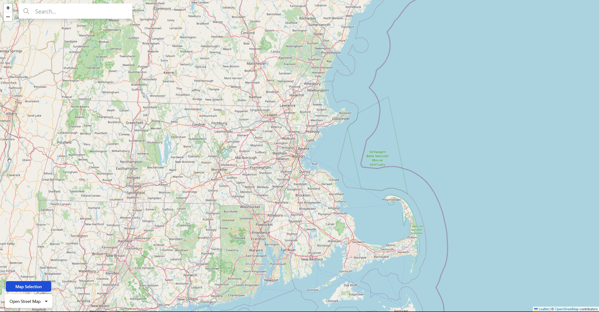

# Map Search Test
Simple map application, using React, Leaflet, Google Maps, Open Street Map, TailwindCSS, DaisyUI and Redux.
Typing into search bar attemps to autocomplete your search with sample locations.
Once location is clicked, a modal is opened showing details about the location and map becomes centered on location.